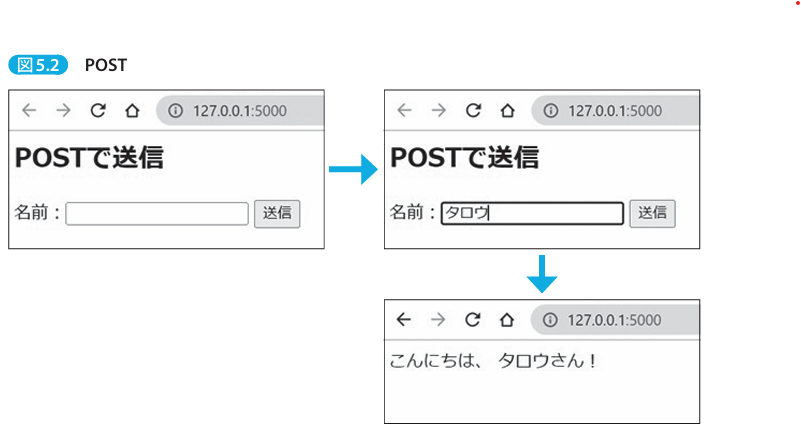

# Formの基本

Formに入力したデータはサーバに送信されて処理される。
まずは、webアプリ開発に必須知識となる、リクエストの種類から説明する。


## 5-1-1：HTTPメソッドとは？

- HTTPメソッドとは、webアプリがサーバに対して行うリクエストの種類のこと。
- 主要なHTTPメソッドは、2つ。
	- GETメソッド
		- サーバから情報を**取得**するために使用される。webサーバがリクエストされた情報をブラウザに返す。
	- POSTメソッド
		- サーバにデータを**送信**するために使用される。通常はwebフォームの情報を送信するために使用される。webサーバは受信したデータを処理し、応答を返す。
- 違いは、GETは、URLの末尾にデータを追加して送信する一方で、POSTはHTTPボディにデータを含めて送信する。したがって、データを送る情報サイズに違いがある。GETはURLの末尾にデータを追加して送信するため、データ量に制限がある。一方で、POSTはHTTPボディにデータを含めて送信するため、データサイズに制限がない。


```python

# GETでデータ取得
@app.route("/get")
def do_get():
	name = request.args.get("name") # リクエストパラメータを取得する
	return f"ハロー、{name}さん"


# POSTでデータ取得
@app.route("/", methods=["GET", "POST"])
def do_get_post():
	if request.method == "POST":
		name = request.form.get("name") # リクエストボディからデータを取得する
		return f"こんにちは、{name}さん"
	return """
	<h2>POSTで送信</h2>
	<form method='post'>
		名前：<input type='text' name='name'>
		<input type='submit' value='送信'>
	</form>
	"""
```


- Flaskのルーティングでは、HTTPメソッドに応じて、異なる動作をさせられる。
- `methods=["GET", "POST"]` は、Flaskアプリのルーディングで、GETとPOSTの両方に対応することを示している。


### 実行結果（POST）




### 実行結果（GET）

- 実行させるためには、`http://localhost:8000/get?name=jirou`と入力する必要がある。
- 結果、`ハロー、jirouさん！`と表示される


