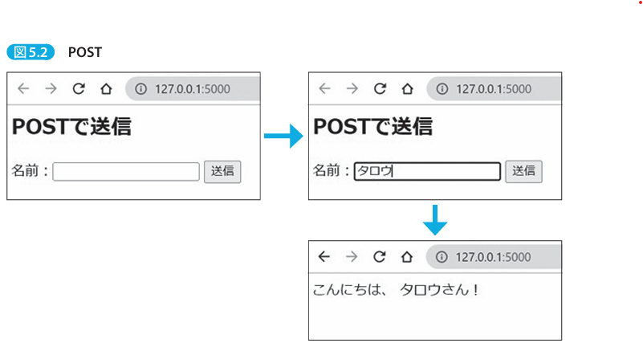
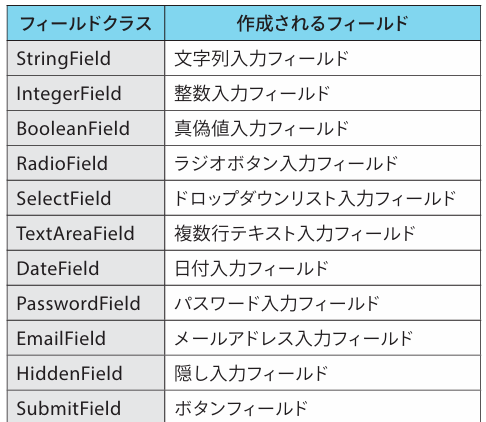
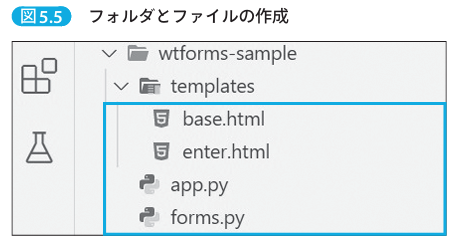
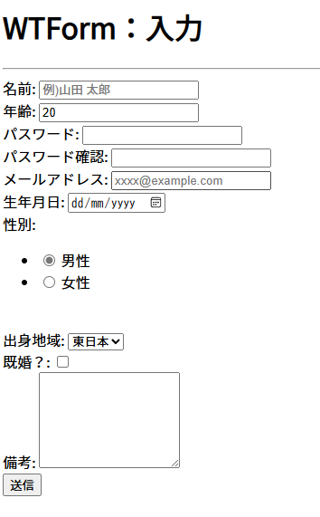

# Formの基本

Formに入力したデータはサーバに送信されて処理される。
まずは、webアプリ開発に必須知識となる、リクエストの種類から説明する。


## 5-1：HTTPメソッドとは？

- HTTPメソッドとは、webアプリがサーバに対して行うリクエストの種類のこと。
- 主要なHTTPメソッドは、2つ。
	- GETメソッド
		- サーバから情報を**取得**するために使用される。webサーバがリクエストされた情報をブラウザに返す。
	- POSTメソッド
		- サーバにデータを**送信**するために使用される。通常はwebフォームの情報を送信するために使用される。webサーバは受信したデータを処理し、応答を返す。
- 違いは、GETは、URLの末尾にデータを追加して送信する一方で、POSTはHTTPボディにデータを含めて送信する。したがって、データを送る情報サイズに違いがある。GETはURLの末尾にデータを追加して送信するため、データ量に制限がある。一方で、POSTはHTTPボディにデータを含めて送信するため、データサイズに制限がない。


```python

# GETでデータ取得
@app.route("/get")
def do_get():
	name = request.args.get("name") # リクエストパラメータを取得する
	return f"ハロー、{name}さん"


# POSTでデータ取得
@app.route("/", methods=["GET", "POST"])
def do_get_post():
	if request.method == "POST":
		name = request.form.get("name") # リクエストボディからデータを取得する
		return f"こんにちは、{name}さん"
	return """
	<h2>POSTで送信</h2>
	<form method='post'>
		名前：<input type='text' name='name'>
		<input type='submit' value='送信'>
	</form>
	"""
```


- Flaskのルーティングでは、HTTPメソッドに応じて、異なる動作をさせられる。
- `methods=["GET", "POST"]` は、Flaskアプリのルーディングで、GETとPOSTの両方に対応することを示している。


### 実行結果（POST）




### 実行結果（GET）

- 実行させるためには、`http://localhost:8000/get?name=jirou`と入力する必要がある。
- 結果、`ハロー、jirouさん！`と表示される


## WTFormsを使おう

- WTFormsとは？
	- Flaskで使用されるフォーム処理ライブラリ
	- このライブラリを使うことで、フォームを簡単に作成でき、かつ入力値の検証やセキュリティ対策を簡単に行える
- インストール方法
	- `pip install wtforms==3.0.1`


### 5-2-2：WTFormsの使用方法

- 下表のフィールドを簡単に作成できる。入力フィールドに適用するバリデーション規則も定義可能。




#### pythonとhtml作成




```python:forms.py
from wtforms import Form
from wtforms.fields import (
    StringField, IntegerField, PasswordField, DateField, 
    RadioField, SelectField, BooleanField, TextAreaField,
    EmailField, SubmitField
)

# ---------------------------
# Formクラス
# ユーザ情報クラス
class UserInfoForm(Form):
	name = StringField("名前: ", render_kw={"placeholder": "例)山田 太郎"})
	age = IntegerField("年齢: ", default=20)
	password = PasswordField("パスワード: ")
	confirm_password = PasswordField("パスワード確認: ")
	email = EmailField("メールアドレス: ")
	birthday = DateField("生年月日: ", format="%Y-%m-%d", render_kw={"placeholder": "yyyy/mm/dd"})
	gender = RadioField(
		"性別: ", choices=[("man", "男性"), ("woman", "女性")],
		default = "man"
	)
	area = SelectField("出身地域: ", choices=[("east", "東日本"), ("west", "西日本")])
	is_married = BooleanField("既婚？: ")
	note = TextAreaField("備考: ")
	submit = SubmitField("送信")
```

```python:app.py
from flask import Flask, render_template, request

app = Flask(__name__)

# ------------------------------
# forms.pyで作成したUserInfoFormを利用する
from forms import UserInfoForm

@app.route('/', methods=['GET','POST'])
def show_enter():
    # フォームの作成
    form = UserInfoForm(request.form)
    # POST
    if request.method == "POST":
        pass
    # GET
    return render_template('enter.html', form=form)


if __name__ == '__main__':
	app.run(
		host='0.0.0.0', 
		port=5000, # 起動しているサーバ（dockerならコンテナ）のポート番号
		debug=True # デバッグモードをオンにするとインタラクティブに画面を更新することができる
	)
```

```html:base.html
<!DOCTYPE html>
<html lang="ja">
<head>
    <meta charset="utf-8" />
    <title>WTForm</title>
</head>
<body>
     タイトル 
    <hr />
     内容 
</body>
</html>
```


```html;enter.html



    <h1>WTForm：入力</h1>



    <form method="POST">
        {{ form.name.label }}{{ form.name(size=20) }}<br>
        {{ form.age.label }}{{ form.age() }}<br>
        {{ form.password.label }}{{ form.password(size=20) }}<br>
        {{ form.confirm_password.label }}{{ form.confirm_password(size=20) }}<br>
        {{ form.email.label }}{{ form.email(placeholder="xxxx@example.com") }}<br>
        {{ form.birthday.label }}{{ form.birthday() }}<br>
        {{ form.gender.label }}{{ form.gender() }}<br>
        {{ form.area.label }}{{ form.area() }}<br>
        {{ form.is_married.label }}{{ form.is_married() }}<br>
        {{ form.note.label }}{{ form.note(style="height:100px; width:150px")}}<br>
        {{ form.submit() }}
    </form>

```

- `enter.html`に記載している、`{{ form.フィールド.label }}`には、forms.pyで定義したラベルが表示される。
- `{{ form.name(size=20) }}`の引数部分は、見た目や動作を調整するためのHTML属性を設定する。※他にも調整するための引数がある（ここでは紹介しない）。


##### 実行結果



### バリデーションを使ってみる（wtforms.validatorsとは？）

- ユーザが入力したデータが適切な形式であるかどうかを確認する方法である。例えば、メアドが正しい形式で入力されているかどうか、数字フィールドに数字が入力されているかどうか、などのチェックを行える。


